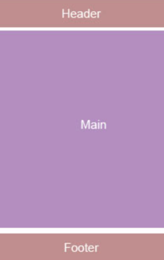

## Задание 1

Сделать страничку как на рисунке выше.
Хедер и футер должны занимать по 150px в высоту.
Хедер и футер должны быть прижаты к верху и низу страницы соответственно.

Заголовок должен быть по центру по горизонтали(!), по вертикали не обязательно, и иметь размер шрифта 24px.

Страница не должна иметь ни горизонтальной ни вертикальной прокрутки.

## Задание 2

Сделать кнопку, которая будет максимально похожа на эту.
Разместить ее по центру страницы по горизонтали, и верхний и нижний отступ (margin) должны быть по 100px.
