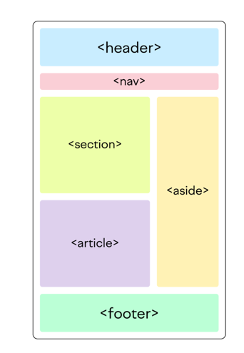

## Задание 1

```<!DOCTYPE html>
<html lang="en">
  <head>
    <meta charset="UTF-8" />
    <title>Document</title>
    <link
      rel="stylesheet"
      href="https://cdnjs.cloudflare.com/ajax/libs/normalize/8.0.1/normalize.min.css"
      integrity="sha256-l85OmPOjvil/SOvVt3HnSSjzF1TUMyT9eV0c2BzEGzU="
      crossorigin="anonymous"
    />
  </head>

  <body>
    <div class="block block_red"></div>
    <div class="block block_green"></div>
    <div class="block block_blue"></div>
    <div class="block block_yellow"></div>
    <div class="block block_black"></div>
  </body>
</html>
```

Выше Вы можете скопировать себе базовую разметку.

HTML должен оставаться неизменным. Для добавления стилей используй styles.css
Отобрази 5 блоков разных цветов, в одной строке. Используй flexbox для расположения и задания ширины блоков
Основные требования:
1. Высота блоков - 300px. По ширине они должны помещаться ровно на ширину экрана
2. Цвета: Блок 1 - red, Блок 2 - green, Блок 3 - blue, Блок 4 - yellow, Блок 5 - black
3. Классы блоков должны быть block_red, block_green, block_blue, block_yellow, block_black соответственно

## Задание 2



Сделать разметку вот такой странички используя flexbox.
Header nav & footer должны иметь строго заданную высоту,
а остальные блоки должны занимать всё оставшееся пространство как минимум по высоте.
Если контента будет больше в них, то они должны расти по высоте.


## Задание 3

Постараться еще поиграть в игры на закрепление материала:

1. https://flexboxfroggy.com/#ru

2. http://www.flexboxdefense.com/
