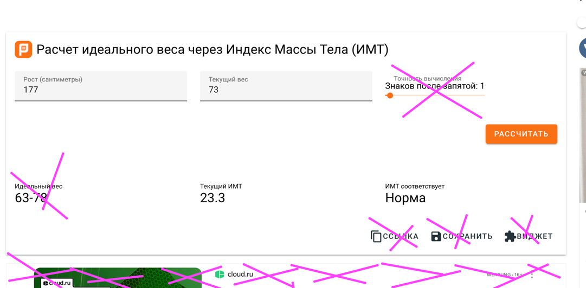

## Задание. Практика HMTL & CSS.

Создать форму, у которой 2 поля, и 1 кнопка.
Поля предусматривают ввод роста и веса человека, кнопка - отправку данных.

Также предусмотреть блок, в который будет выводиться результат расчета индекса массы тела (BMI),
и второй блок - результат, который будет говорить о том, соответствует ли индекс массы тела норме.

По сути как вот здесь, но дизайн другой:

