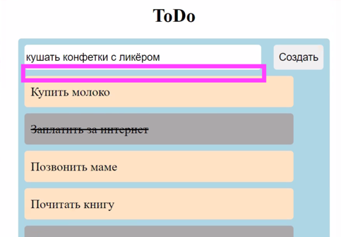

## Задание

1. Кто не успел на уроке, сделать чтобы пользователь мог
дополнить список задач своей задачей (ввел в инпут и нажал кнопку) и задача появилась в списке.

2. Сделать чтобы таски зачеркивались при клике на них.
А при клике на зачеркнутую задачу, она становилась не зачеркнутой.

3. А после этого в месте выделенном розовеньким,
добавить функционал чтобы пользователь мог видеть только
задачи определенного типа: все, выполненные, не выполненные.

